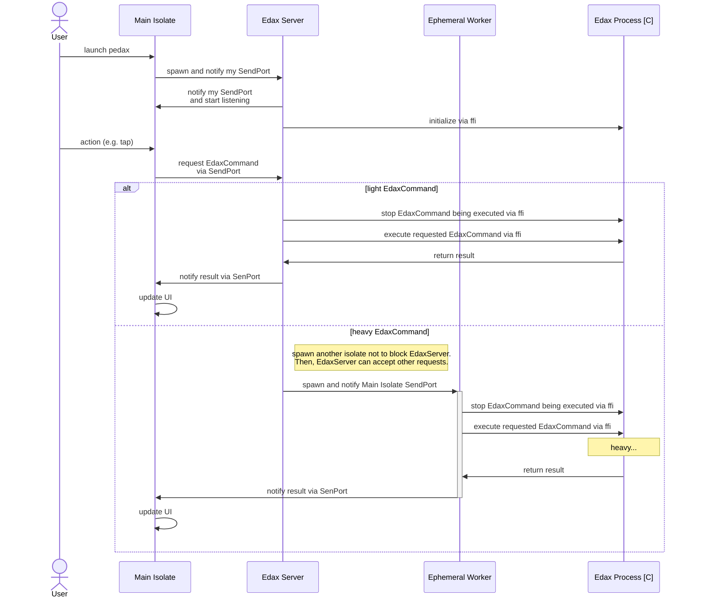

<h1>

<a href="https://sensuikan1973.github.io/pedax/">pedax</a>
</h1>


<div>
  <br/>
  <br/>
  <em>pedax</em> is Reversi Board GUI with <a href="https://sensuikan1973.github.io/edax-reversi">edax</a>, which is the strongest reversi program.
  <br/>
  <br/>
  <em>pedax</em> has 4 features.
  <ul>
    <li>
      <b>Mac/Windows/Linux</b> are supported. <a href="https://sensuikan1973.github.io/pedax/">You can install from Mac App Store or Microsoft Store</a>.
    </li>
    <li>
      <b>Seamlessly</b>, you can see <code>evaluation value</code>, e.g. <code>+4</code>, <code>-10</code>.
    </li>
    <li>
      <b>Customizable</b> important options, e.g. <code>book file path</code>, <code>search level</code>, <code>advanced indicator</code>.
    </li>
    <li>
      <b>2 languages (English, Japanese)</b> are supported.
    </li>
  </ul>
</div>
<br clear="all">

---

## Development


[](https://codecov.io/gh/sensuikan1973/pedax)

### Run

```sh
./scripts/setup_flutter.sh
flutter run --dart-define "SENTRY_DSN=xxx" # env is optional
```

### Architecture

The technical point of pedax is as follows.

- pedax needs to call _Expensive_ _Native(C)_ logic such as computing evaluation value.
- _Native(C)_ logic needs allocated large data. It's desirable to daemonize _Native(C)_ process on background.

So, I have to use [isolate](https://dart.dev/guides/language/concurrency) with ffi([libedax4dart](https://github.com/sensuikan1973/libedax4dart)) skillfully to achieve _seamless non-blocking_ UI.



### References

- [`important` issues and PR](https://github.com/sensuikan1973/pedax/issues?q=label%3Aimportant+)
- [Flutter on Desktop](https://flutter.dev/desktop)
  - [official prototype Desktop Plugins](https://github.com/google/flutter-desktop-embedding/tree/master/plugins)
  - [official desktop app sample | Photo Search app](https://github.com/flutter/samples/tree/master/desktop_photo_search)
  - Real World example
    - [Flutter Gallery](https://github.com/flutter/gallery)
    - [authpass](https://github.com/authpass/authpass)
    - [Mixin Messenger Desktop](https://github.com/MixinNetwork/flutter-app)
      - useful plugins: https://github.com/MixinNetwork/flutter-plugins
